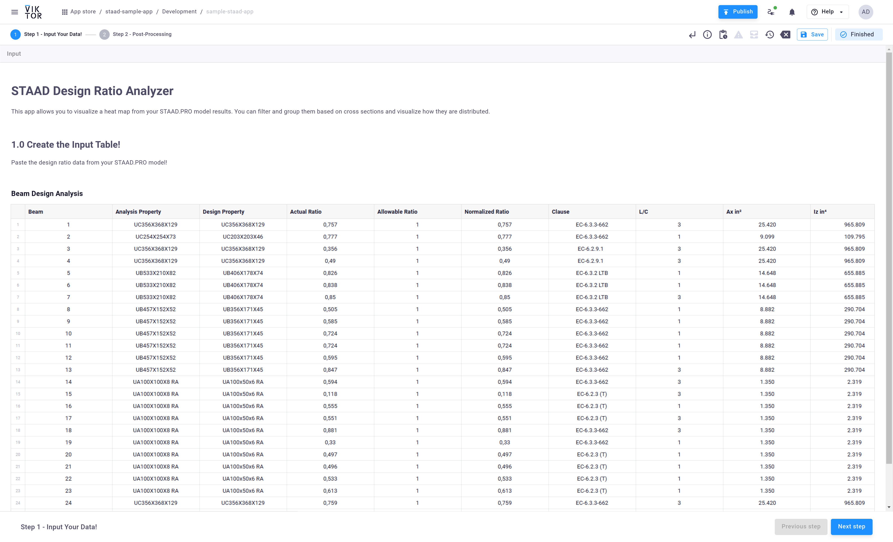
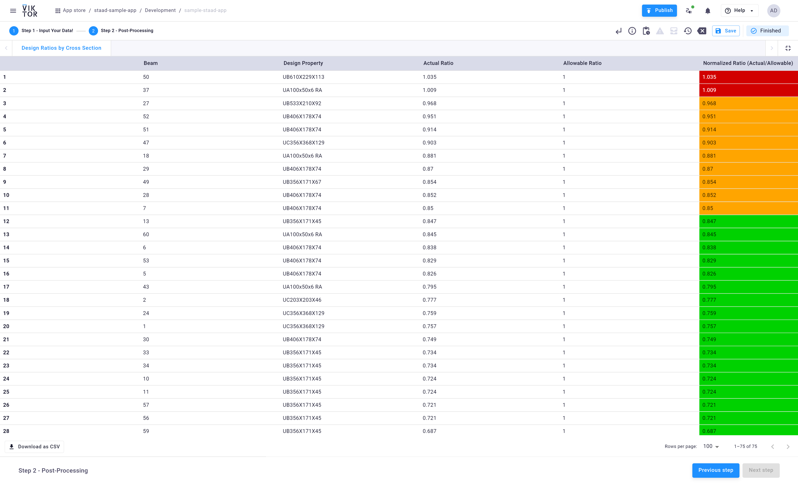

# Post-Process STAAD.PRO Data

In this tutorial, you will build a VIKTOR app to process and visualize outputs from STAAD.Pro. You will see how to export these outputs from STAAD.Pro directly into VIKTOR, and process design ratios for multiple load combinations. Along the way, you will use Pandas, taking advantage of the flexible components that VIKTOR offers.

Here is what we will cover:

1. Creating an input table to receive STAAD.Pro data  
2. Processing the exported data within VIKTOR  
3. Displaying processed outputs for user selection  
4. Generating a table view that shows the distribution of design ratios  

By the end of this tutorial, you will be able to produce a nice visualization of the beam design ratios for your structure by choosing different cross sections. This will allow you to share key results with your clients and project team. You will also learn how to automate the process through VIKTOR. The final result will resemble the figures shown below:

## STEP 1 - Input Table
This step displays the raw STAAD.Pro design ratio data provided by the user in a `vkt.Table` component.

## STEP 2 - Table View
This step showcases the processed STAAD.Pro data with a heatmap view for normalized ratios.

